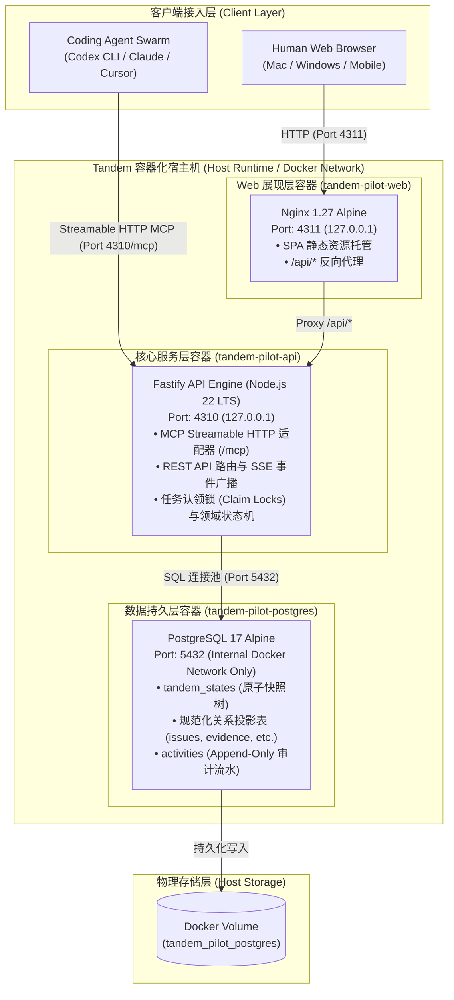

# Tandem 物理部署架构设计 (Physical Deployment Architecture)

## 文档信息 (Document Metadata)

- 文档状态: `REVIEWED`
- 所属项目: `TAN` (Tandem MVP)
- 适用范围: 3–5 人工程师团队 + 多 AI Coding Agent 混合研发协同
- 依赖基线: [系统设计说明书 (System Design)](system-design.md), [信息架构说明书 (Information Architecture)](information-architecture.md)
- 修订日期: 2026-08-18

---

## 1. 架构目标与设计原则 (Goals & Principles)

Tandem 作为 AI Coding Agent 时代的交付记忆与协同中枢，其物理部署架构严格遵循以下设计原则：

1. **单体优先，极简运维 (Monolith First, Minimal Ops)**：通过轻量容器化编排实现零外部重依赖部署，无 Redis/Kafka 等繁重中间件，降低中小团队运维复杂度。
2. **双接口对齐 (Dual Interfaces Alignment)**：人类 Web 界面与 Coding Agent MCP 协议共用同一套底层领域服务与 PostgreSQL 存储。
3. **数据主权与物理持久化 (Data Durability & Isolation)**：采用 PostgreSQL 17 混合持久化模型（快照 JSON + 规范化投影表 + Append-Only 审计日志），数据卷与网络严格物理隔离。
4. **防御性安全与只读容器 (Defense in Depth & Immutability)**：生产容器采用只读文件系统、非 Root 降权与本地回环绑定，杜绝安全逃逸。

---

## 2. 物理拓扑架构图 (Physical Topology Diagram)



---

## 3. 核心物理节点与组件规范 (Components Specification)

| 节点名称 | 容器镜像 / 运行环境 | 网络与端口规范 | 核心职责与安全策略 |
| :--- | :--- | :--- | :--- |
| **`tandem-pilot-web`** | `nginx:1.27-alpine` | `127.0.0.1:4311:80` (HTTP) | • 托管 React 19 + Vite 编译后的 SPA 生产静态资产<br>• 将 `/api/*` 转发到 API 容器<br>• 容器以 `read_only: true` 运行，缓存挂载在 `tmpfs` |
| **`tandem-pilot-api`** | `node:22-alpine` | `127.0.0.1:4310:4310` (HTTP) | • 提供面向 Agent 的 `/mcp` 端点（Streamable HTTP）<br>• 提供面向 Web 的 RESTful API 与 SSE 实时通道<br>• 执行领域规则、上下文哈希校验、Evidence 凭证收集<br>• `read_only: true`，临时文件走 `/tmp (tmpfs)` |
| **`tandem-pilot-postgres`** | `postgres:17-alpine` | `5432/tcp` (仅内部网段互通) | • 维护核心业务状态与版本迁移（Schema Migrations）<br>• **不对宿主机开放端口**，防止外部恶意扫描<br>• 配置原生 Healthcheck 探针 |
| **`tandem_pilot_postgres`** | 宿主机本地存储卷 | Docker Named Volume | • 确保存储数据即使在镜像升级、容器销毁重建时零丢失 |

---

## 4. 网络安全与鉴权模型 (Security & Auth Model)

```text
       [外部请求]
           │
     ┌─────┴────────────────────────────────┐
     │ 检查请求头 Authorization: Bearer <Token>│
     └─────┬────────────────────────────────┘
           ├───────────────────────────────┬───────────────────────────────┐
           ▼                               ▼                               ▼
    [Human Bearer Token]          [Agent Bearer Token]           [未鉴权 / 非法 Token]
           │                               │                               │
    • 完整管理权限                 • 限制为 MCP 协作权限           • 拦截抛出 401 Unauthorized
    • 审查批准 (Decision/Approve)   • 上下文读取/认领/上传凭证       • 阻止任何数据访问
    • 密码重置与凭证吊销           • 严禁冒充人类进行最终签批
```

1. **最小特权原则 (Least Privilege)**：所有容器运行均开启 `security_opt: ["no-new-privileges:true"]`。
2. **多租户/项目隔离 (Project Scoping)**：API 与 MCP 操作均严格校验 Token 所属的项目访问范围（Project Scope），杜绝跨项目越权。

---

## 5. 运维与生命周期管理 (Operational Runbook)

通过项目根目录提供的标准脚本 [`./tandem.sh`](../../tandem.sh) 进行全生命周期自动化管理：

```bash
# 启动完整物理集群
./tandem.sh up

# 检查物理节点运行状态与健康探针
./tandem.sh status

# 查看分布式组件实时日志
./tandem.sh logs api
./tandem.sh logs web

# 重启或停止物理集群
./tandem.sh restart
./tandem.sh down
```
