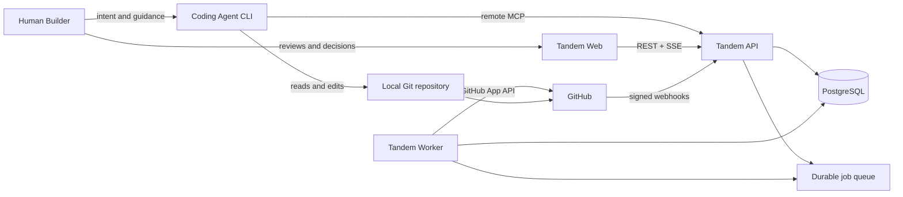
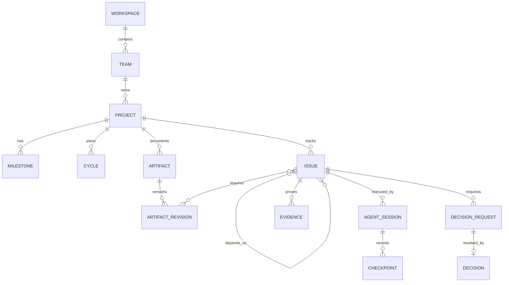

# Tandem MVP System Design

## Document Information

- Status: `REVIEWED`
- Scope: one 3–5 person Agent-first software team
- Review date: 2026-08-08
- Depends on: [MVP PRD](../prd/tandem-mvp-prd.md) and [Information Architecture](information-architecture.md)
- Revision: first-real-project bootstrap and Quick Work delivery path

## 1. Design Goal

Tandem is a durable delivery memory and coordination layer used mostly by Coding Agents through MCP and inspected by Humans through Web. It connects conversation conclusions, versioned engineering Artifacts, Agile work, Agent onboarding, evidence, Human decisions, and Git delivery.

Tandem does not host models, run sandboxes, launch Agents, replace Git, or retain private reasoning.

## 2. Architecture Principles

1. **One domain, two interfaces**: MCP and Web/REST call the same application services.
2. **Agent-first, Human-authoritative where policy requires**: Agents can plan and execute autonomously; actor provenance cannot be forged.
3. **Baseline plus proposals**: current effective content is explicit and immutable; changes create revisions.
4. **Onboarding is executable policy**: implementation claims require acknowledged current context.
5. **Ready is derived**: dependency, Artifact, and policy conditions determine readiness.
6. **Current projections plus audit**: relational state supports reads; meaningful changes append Activity.
7. **Git-backed engineering truth**: Git content and Tandem workflow metadata remain correlated by immutable references.
8. **Monolith first**: one repository and PostgreSQL, with separable web, API, and worker processes.
9. **Retry-safe machine writes**: MCP/API mutations are idempotent and concurrency checked.

## 3. Context

## 4. Runtime and Repository

- `apps/web`: React Human oversight application.
- `apps/api`: Fastify REST, MCP Streamable HTTP, auth, webhook, and SSE adapters.
- `apps/worker`: reconciliation and retryable background jobs.
- `packages/contracts`: Zod command, query, and response schemas.
- `packages/domain`: policies, transitions, and application services.
- `packages/db`: Drizzle schema, migrations, and repositories.
- `packages/ui`: accessible UI primitives and tokens.
- `packages/config`: environment validation and shared tooling.

The first executable slice uses an atomic local state-file repository behind the same domain boundary so process restarts preserve the workflow. PostgreSQL remains mandatory before shared pilot deployment and will replace this single-instance adapter without changing MCP/REST commands.

## 5. Technology Stack

| Layer | Choice |
|---|---|
| Language/runtime | TypeScript strict mode, Node.js 22+ |
| Workspace/build | pnpm workspaces; package scripts before optional Turborepo |
| Web | React 19, Vite, TanStack Query, custom accessible CSS |
| API | Fastify, Zod, OpenAPI-compatible JSON schemas |
| Persistence | Atomic local state file for Iteration 0; PostgreSQL 17+, Drizzle, SQL migrations before shared pilot |
| Jobs | PostgreSQL-backed queue; no Redis in MVP |
| Live updates | Server-Sent Events |
| Agent protocol | MCP TypeScript SDK v1.x, Streamable HTTP |
| Git | GitHub App, Octokit, signed webhooks |
| Tests | Vitest, Testcontainers integration, Playwright E2E |
| Deployment | Docker Compose locally; small managed container platform for pilot |

## 6. Domain Model

### Main aggregates

- **Planning**: Workspace, Team, optional Initiative, Project, Milestone, Cycle, Cycle Revision.
- **Work**: Issue/Sub-issue, dependency edges, claim, affected modules, branch/worktree.
- **Knowledge**: Artifact, immutable Artifact Revision, work links, Git content anchor.
- **Execution**: Agent Identity, Agent Session, onboarding manifest/acknowledgement, checkpoint, handoff.
- **Assurance**: Evidence, Decision Request, Decision, Git Artifact, Activity.

## 7. Relational Data Shape

| Table | Key fields |
|---|---|
| `principals` | Human/Agent type, normalized Human username, display name, status, roles, Project scopes, capabilities |
| `principal_credentials` | principal, credential kind, label, one-way secret verifier, expiry, revocation, last use |
| `web_sessions` | Human principal, one-way session verifier, expiry, revocation, creation metadata |
| `projects`, `milestones`, `cycles`, `cycle_revisions` | goal, success, target, state, immutable plan digest |
| `issues` | key, type, delivery_path, intake_source, risk_class, parent, state, acceptance, priority, cycle, milestone, version |
| `issue_dependencies` | blocker, blocked, type, created_by |
| `issue_claims` | issue, session, actor, claimed/released timestamps |
| `artifacts`, `artifact_revisions` | type, state, content, digest, storage mode, provenance |
| `artifact_git_anchors` | repository, path, commit, blob, content digest |
| `artifact_work_links` | revision, Project/Cycle/Issue, relation |
| `agent_sessions` | Agent, Project, Issue, state, context digest, timestamps |
| `session_context_items` | Artifact revision or code anchor, required, acknowledged |
| `checkpoints`, `handoffs` | semantic summary, decisions, risks, next steps |
| `evidence` | type, result, URI, payload, observed time |
| `decision_requests`, `decisions` | policy, proposal, risk, actor type, rationale |
| `git_artifacts`, `webhook_deliveries` | branch/commit/PR/check projection and dedupe |
| `activities`, `idempotency_keys` | immutable audit and replay-safe responses |

All mutable roots use UUID identity and integer optimistic version. Workspace/Team scope is explicit on access paths.

## 8. Core Invariants

- an Artifact revision digest and content never change after checkpoint;
- baselining a revision supersedes the previous effective revision but retains it;
- a Cycle plan change creates a revision and records Issue/dependency impact;
- dependency cycles are rejected;
- an Issue is Ready only when blockers are complete and required Artifact baselines exist;
- one Issue has at most one active claim;
- implementation claim requires an active Agent Session with current onboarding acknowledgement;
- changing a required baseline changes the Project context digest and marks older Sessions stale;
- stale Sessions may checkpoint or hand off but cannot claim new implementation work until refreshed;
- Human-only policies accept only an authenticated Human actor;
- GitHub Projects 5-column Kanban projection maps `baseState` and `activeClaim` into:
  - **Backlog**: `baseState in [backlog, blocked]`
  - **Ready**: `baseState == ready` and `activeClaim == null`
  - **In Progress**: `baseState == ready` and `activeClaim != null` (Display State: `claimed`)
  - **In Review**: `baseState == review` (Agent submitted handoff; awaiting Human verification)
  - **Done**: `baseState == done` (Human verified or policy auto-completed)
- `human_stated` preserves Agent-reported provenance and is not equivalent to `human_decision`;
- completed Issues require a handoff and policy-required evidence;
- Quick Work uses the normal onboarding, claim, evidence, authority, and completion invariants;
- promotion from Quick Work changes its delivery path and planning requirements without replacing its Issue identity or losing provenance;
- raw transcripts and private reasoning are outside the model.

## 9. State and Policy

Clients submit commands, never arbitrary final status.

- Cycle: `draft -> proposed -> active -> completed | cancelled`.
- Issue: `backlog -> ready -> claimed -> in_progress -> review -> verified -> done`, with `blocked/cancelled` side states.
- Artifact revision: `working_draft -> proposed -> baselined -> superseded | drifted | archived`.
- Session: `onboarding -> active -> waiting_human -> handed_off | finished`.

Every consequential transition records authority as `human_decision`, `human_stated`, `policy_passed`, or `agent_recommendation`.

For the MVP Human delivery review, one Human-only application command resolves an Issue in `review` with an explicit rationale:

- `approved` passes the verification gate and completes the Issue atomically, clears its active claim, and records `issue.completed` with `human_decision` authority;
- `changes_requested` clears the handed-off claim, preserves all prior Session, Evidence, and Handoff records, returns the Issue to dependency/context-derived readiness, and records `issue.changes_requested` with the Human rationale;
- any Agent credential or non-review Issue fails closed before mutation, and idempotency replay cannot duplicate the transition or Activity.

### Quick Work policy

`delivery_path` is either `quick` or `planned`. It is orthogonal to Issue type and state. A Bug, Improvement, or Chore may start as Quick Work when its intended outcome is bounded, Project context exists, and no material-risk trigger is present.

The capture command stores the authenticated actor, source kind (`agent_conversation`, `human_web`, `import`, or `integration`), optional source reference, supplied facts, and missing-field warnings. An Agent may fill missing structured details as an attributed revision. The original statement remains visible in audit history.

Promotion is deterministic and idempotent. It occurs before claim or during scope-change evaluation when any of these are true:

- public API/data contract or database migration impact;
- security, privacy, permission, billing, destructive, or release impact;
- accepted Product/Design/Test baseline must change;
- cross-Project work, multiple dependent Issues, or material outcome ambiguity;
- policy or Human explicitly requires planned handling.

Promotion keeps the Issue key and history, sets `delivery_path=planned`, identifies missing planning/Artifact requirements, recalculates Ready, and creates Human Attention only when policy requires an actual Human decision. A Cycle remains optional.

Bug completion requires regression evidence. Improvement completion requires evidence against its before/after acceptance. Chore completion requires the declared verification method. Low risk changes may reach `done` through `policy_passed`; Human experience or authority gates still apply when configured.

## 10. First-Real-Project Bootstrap

The seeded `TAN` Project is development data only. Hosted and pilot behavior is Project-key and repository scoped.

Bootstrap is one idempotent application command available to authenticated Human administrators and appropriately scoped Agents. It creates:

- Project key, name, goal, owner, Team, and initial policy profile;
- one or more normalized repository bindings;
- optional Milestone and Cycle, neither required;
- imported or Tandem-draft Artifact records for current product, design, data/API, and test guidance;
- an onboarding-readiness report showing missing baseline or repository instructions.

Project keys are unique within the Team. Repository discovery normalizes provider, host, owner, and repository rather than comparing raw remote strings. Resolution order is explicit Project key, Issue key prefix, then bound Git remote; ambiguous remote bindings fail closed. Web routes, SSE subjects, GitHub correlation, MCP resources, authorization scopes, and query projections all carry the resolved Project identity—none may default silently to `TAN` in production.

The minimum bootstrap does not require a complete PRD. Existing documents may be imported, and an Agent may propose missing Artifacts after reading the repository. Implementation work becomes Ready only when the Project's configured context policy is satisfied.

## 11. MCP Interface

Remote MCP is the primary Agent integration. Tools are thin adapters over domain commands:

- context: `start_session`, `confirm_understanding`, `refresh_session_context`;
- knowledge: `upsert_artifact_draft`, `checkpoint_artifact`, `propose_artifact_baseline`;
- planning: `create_project`, `plan_cycle`, `create_issue`, `add_issue_dependency`;
- execution: `list_ready_issues`, `claim_issue`, `update_issue`, `record_checkpoint`;
- assurance: `attach_evidence`, `request_human_decision`, `submit_handoff`, `complete_issue`, `finish_session`.

Resource templates expose Project guidance, effective baselines, optional Cycle plan, Ready work, Issue context, and prior handoffs for any authorized Project key. Every response contains stable IDs/keys, object version, current state, permitted next actions, and a Project-specific Human Web URL.

`create_project` implements bootstrap. `create_issue` accepts `deliveryPath=quick|planned`, typed intake details, source reference, and optional Cycle/Milestone. The service—not the MCP adapter—calculates risk, promotion, readiness, and required next actions. Existing generic Coding Agent clients need only remote MCP configuration; no Tandem CLI or mandatory Skill is introduced.

MCP authentication uses OAuth for remote clients before pilot. Local development may use an explicit development Agent principal that cannot be enabled in production.

## 12. REST and Human Web

REST query routes support Project discovery, Attention, Project overview, Artifact baseline/diff, Cycle graph, Issue detail, Session detail, Activity, and Settings. Human mutation routes bootstrap Projects, capture Quick Work, create decisions, and administer identity/integrations. Both MCP and REST invoke the same services and write the same Activity records.

Delivery review uses `POST /v1/human/issues/:issueKey/review` with `{ outcome: "approved" | "changes_requested", rationale }`. The existing empty-body `/verify` route remains a backward-compatible approve-only adapter over the same domain command. Web must render the review action only for an Issue currently in `review`, show in-progress/error feedback, refetch canonical Project state after success, and never infer Human approval from merely opening the Issue.

SSE only signals changed projections. The browser refetches canonical query data and reconnects with `Last-Event-ID`.

### Identity, credentials, and Web sessions

`Principal` is the durable actor. Its `type` is immutable (`human` or `agent`), so presenting a different credential can never convert Agent authority into Human authority. Roles, capabilities, and Project scopes are evaluated after authentication on every command.

Human principals have a unique case-insensitive username. Username/password is the default Web login. A successful password or Human personal-access-token login creates a new opaque Web session; the browser cookie contains only that session secret, never the submitted password or long-lived access token. Logout revokes the current session before clearing the cookie. Deactivation revokes all credentials and sessions transactionally while retaining the principal and its audit history.

Credential kinds are explicit:

- `password`: Human-only, one active verifier, derived with Node's memory-hard `scrypt`, a per-credential random salt, versioned work parameters, constant-time comparison, and a 12–128 character input policy;
- `access_token`: allowed for Human and Agent principals, at least 256 bits of random entropy, shown once, stored only as a SHA-256 verifier, independently named, expirable, and revocable;
- `web_session`: Human-only, random and short-lived, stored in `web_sessions` as a SHA-256 verifier, with an eight-hour absolute expiry in the pilot.

The local pilot retains existing bootstrap Human tokens for a non-breaking upgrade. An owner authenticated by the legacy token is prompted to set a username and password; all newly created Humans receive username/password credentials at creation. Hosted remote Agent access remains OAuth-first; locally issued Agent tokens are for localhost/team-controlled deployments and do not weaken actor-type checks.

Identity administration is a Human-only application service protected by `identity:admin`. The pilot grants it to the `owner` role. It supports list/create, password set/reset, independently issued or revoked tokens, activation/deactivation, and Project scope changes. The service rejects Agent callers, cross-scope escalation, duplicate usernames, secret reuse through response replay, self-deactivation, and deactivation or demotion of the last active owner. Mutation responses and Activity records include credential IDs and labels but never secrets or password material. Idempotent token creation returns the original one-time secret only to the original successful request replay; later reads never expose it.

Web information architecture adds:

- sign-in: `Username + Password` (default) and `Access Token` (secondary);
- `Settings > People & Agents`: identity list, status, role, Project access, create Human, create Agent, reset password, issue/revoke token, activate/deactivate;
- `Account`: change own password and manage the signed-in Human's personal access tokens;
- one-time credential result: copy/download warning followed by irreversible dismissal.

## 13. Artifact Storage

### Tandem draft

Working content is stored as Markdown or structured JSON with revision, digest, authorship, source Session, and links. A semantic checkpoint produces an immutable revision.

### Git-backed

When published, Tandem records repository, path, commit SHA, blob SHA, and digest, and retains an immutable display snapshot. Git is authoritative for engineering content at that anchor; new edits create a proposal, never mutate the historical snapshot.

Large files remain external and are referenced by URI plus digest. The MVP does not provide arbitrary file hosting.

## 14. Command Processing

1. Authenticate Human or Agent and construct immutable actor context.
2. Validate Zod contract, scope, expected object version, and idempotency key.
3. Load aggregate and evaluate dependency, onboarding, authority, and evidence policy.
4. Apply transition in one database transaction.
5. Save state, append Activity, and enqueue durable side effects.
6. Return new version, state, warnings, next actions, and Web URL.

Conflicts return `409`; invalid transitions return a stable domain error; retries return the original response.

## 15. GitHub Integration and Security

- GitHub App access is repository-scoped and read-only for contents, metadata, pull requests, and checks.
- Webhooks validate `X-Hub-Signature-256`, persist delivery IDs, and process asynchronously.
- branch, commit trailer, or PR body may include `tandem-issue:<key>` and `tandem-session:<uuid>` for correlation.
- Tandem never merges or deploys in MVP.
- Human sessions use secure HTTP-only, `SameSite=Strict` cookies containing only revocable session secrets; passwords never enter cookies.
- Passwords use versioned `scrypt` verifiers; high-entropy access/session tokens are shown once and stored as one-way SHA-256 verifiers.
- authentication failures use uniform responses and bounded per-identity/IP rate limiting; secrets are redacted from logs, Activity, Evidence, and error payloads.
- authorization is enforced in application services, not only HTTP handlers.
- logs and evidence reject or redact secrets and executable HTML.

## 16. Initial Executable Slice

The first vertical slice proves the product model with:

- a seeded Project, effective Artifacts, Cycle, dependency graph, and Issues;
- calculated Ready/Blocked work;
- Agent Session onboarding and understanding confirmation;
- safe Issue claim, checkpoint, evidence, and handoff commands;
- Human Web Project, Artifact, Cycle, Issue, Session, and Attention views;
- domain tests for dependency, claim, baseline, stale context, and authority invariants.
- restart-safe local state in `.tandem/state.json` for single-instance product validation.

The minimum usable pilot replaces all sample-Project assumptions, adds first-real-project bootstrap and Quick Work capture, and then verifies the same interfaces in PostgreSQL production mode before release.
